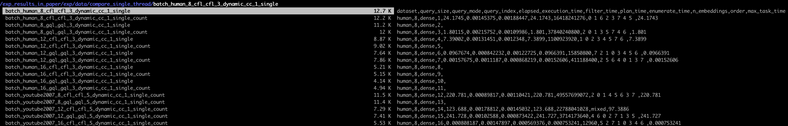

Circinus: an efficient parallel subgraph matching framework that reduces computation redundancy and optimizes memory usage
=======

### Dependency

Circinus has the following required dependencies:

- CMake (>= 3.13.0)
- GCC (>= 8.2.0, requires c++17 support)
- Gflags
- Glog
- [bliss-0.73](http://www.tcs.hut.fi/Software/bliss/bliss-0.73.zip)

For testing, Circinus uses [googletest](https://github.com/google/googletest/releases/tag/release-1.8.0) (needed when `cmake -DBUILD_TESTS=ON`).

#### Installing Bliss

A bash script `scripts/install_bliss.sh` is provided to download and install bliss in the `third_party` folder.
```
git clone <git link> && cd circinus
./scripts/install_bliss.sh
```

### Build Circinus

1. Build and install
```bash
mkdir -p build && cd build
cmake .. -DCMAKE_BUILD_TYPE=Release # CMAKE_BUILD_TYPE: Release, Debug, RelWithDebInfo
make Circinus Benckmark -j4 # 4 if to use 4 threads to compile
```

### Experimental Data and Query

The experiment results in paper is in `exp_results_in_paper/exp/data`. If you want to reproduce the results in paper, please follow steps below.

#### Export the home dir of circinus.
```
export CIRCINUS_HOME=  #project dir
```

#### Download Datasets and queries

Go to https://gofile.io/d/zkjYel and download the datasets and queries file `subgraph_matching_datasets.tar.gz` to `$CIRCINUS_HOME` and decompress it.
```
cd $CIRCINUS_HOME
tar -xzvf subgraph_matching_datasets
```


#### Run querise
Create file to store artifact experiment results.
```
cd $CIRCINUS_HOME
mkdir -p exp_results_artifact/exp/data/
cd exp_results_artifact/exp/data/
mkdir cardinality_sensitivity  compare_peregrine  compare_single_thread  compare_unlabeled  parallelization  redundancy_multithread  vc_influence
```

If we run `tree` in `exp_results_artifact`, we will get 
```
.
└── exp
    └── data
        ├── cardinality_sensitivity
        ├── compare_peregrine
        ├── compare_single_thread
        ├── compare_unlabeled
        ├── parallelization
        ├── redundancy_multithread
        └── vc_influence

9 directories, 0 files
```
which is same as `exp_results_in_paper`.

All experiment scripts are in the `scripts/exp_scripts/`, check details in `scripts/exp_scripts/run_all_exps.sh`. If you run `scripts/exp_scripts/run_all_exps.sh`, the results file format and results format should be same as the circinus' results in `exp_results_in_paper/exp/data/`. The screenshot below is an example of comparison experiment results of single thread labeled queries. 

The file name `batch_human_8_cfl_cfl_3_dynamic_cc_1_single` means query size: 8, algorithm: CFL, vertex cover: dynamic(Circinus in paper), number cores: 1, experiment name: single thread. 

Note that `batch_human_8_cfl_cfl_3_dynamic_cc_1_single_count` is the file from accumulating the intersection count (from the profile result, the scripts will do this automatically) as the last column to `batch_human_8_cfl_cfl_3_dynamic_cc_1_single`.

Each file has 200 lines corresponding to 200 queries. The result format is `dataset,query_size,query_mode,query_index,elapsed_execution_time,filter_time,plan_time,enumerate_time,n_embeddings,order,max_task_time,n_intersections`, first four is about the query graph. 

`elapsed_execution_time` is the execution time of the query, `n_intersections` is the totaly intersection count. Note that lines of **timeout** queries only have four fileds `dataset,query_size,query_mode,query_index`.



